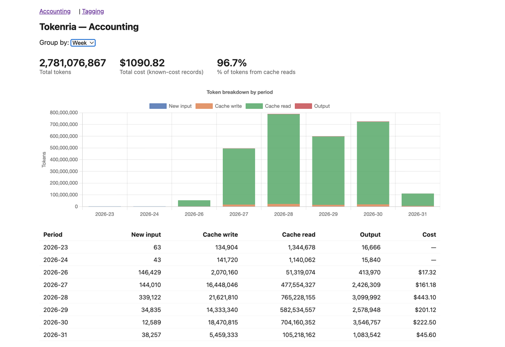
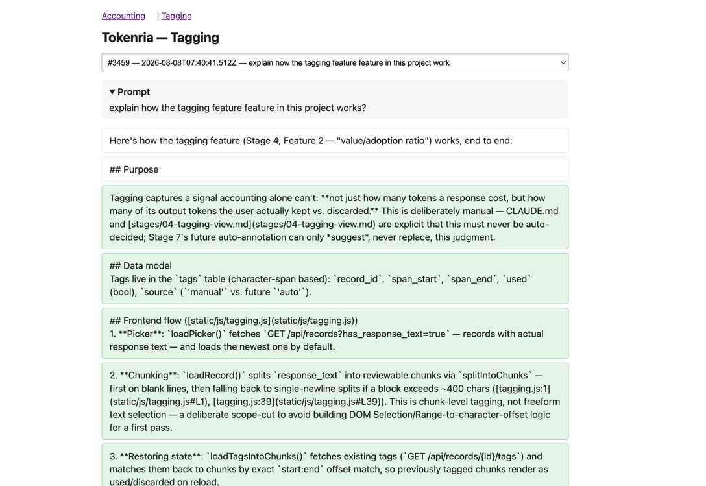
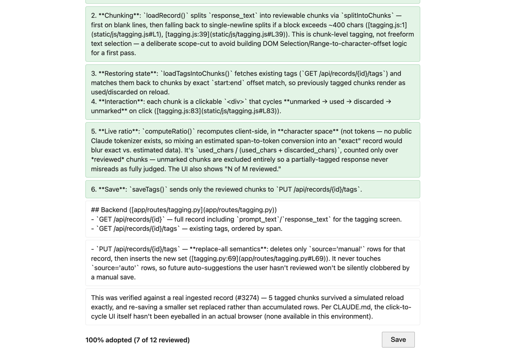

<h1 align="center">Tokenria</h1>

<h3 align="center">See where your LLM tokens actually go, and how much of what you generate is actually worth using.</h3>

<p align="center">
  <a href="#what-tokenria-is">What it is</a> &bull;
  <a href="#features">Features</a> &bull;
  <a href="#screenshots">Screenshots</a> &bull;
  <a href="#getting-started">Getting Started</a> &bull;
  <a href="#design-principles">Design Principles</a> &bull;
  <a href="#roadmap">Roadmap</a> &bull;
  <a href="#contributing">Contributing</a>
</p>

<p align="center">
  <a href="https://github.com/UffaModey/tokenria/actions/workflows/ci.yml"></a>
  <a href="LICENSE"></a>
  
  
  
</p>

<p align="center">
  <sub><strong>Python + FastAPI · SQLite · Vanilla JS · Chart.js</strong> — one process, one database, no build step, no cloud.</sub>
</p>

---

## The Problem

If you use LLMs regularly for work, you're paying for tokens without any real visibility into two things:

1. **Structural waste.** How much of your spend is repeated system prompts, tool schemas, and conversation history versus genuinely new work.
2. **Value waste.** How much of what the model generates you actually use, versus how much gets discarded, ignored, or rewritten.

Usage dashboards from LLM providers show you totals. They don't show you whether that spend was productive. Tokenria closes that gap — locally, on your own machine, from your own data.

## What Tokenria Is

Tokenria does not reveal the internal mechanics of how a closed model (Claude, GPT, Gemini, etc.) decides which tokens to generate — that requires access to model internals, which API-based tools do not have and cannot fake. Tokenria focuses on what's actually measurable: real token counts from real usage data, and the value you assign to what was produced.

## Features

- 📊 **Token Accounting** — parses Claude Code session transcripts (exact, per-turn token counts, no export step required), breaking usage down into new input / cache write / cache read / output, rolled up by day, week, or month with cost attached. Answers *"where is my money structurally going."* Ingesting raw Anthropic/OpenAI API response objects is the same category of source and is next on the [roadmap](#roadmap).
- ✍️ **Manual Value Tagging** — click through any response's chunks and mark each one used or discarded. Produces an adoption ratio (tokens kept / tokens generated) per response, tracked over time — the honest signal of value, based entirely on your own judgment, never an automated guess.
- 🤖 **Optional Auto-Annotation** *(planned)* — a cheap secondary LLM pass that pre-highlights likely-useful vs. likely-filler chunks before your manual review. Always editable, always labeled as a suggestion, never a substitute for your own call.

Every ingested record is tagged as either *exact* (real provider usage data) or *estimated* (locally tokenized pasted text), so accounting reports never blur the two.

## Screenshots

**Accounting** — structural token/cost breakdown by week, with a running total and a per-period detail table:



**Tagging** — pick a record, review its response chunk by chunk, and get a live adoption ratio as you go:




## Getting Started

```bash
python3 -m venv .venv && source .venv/bin/activate
pip install fastapi uvicorn tiktoken python-dotenv pytest ruff httpx
```

Ingest your real Claude Code usage data (parses every session under `~/.claude/projects/**/*.jsonl`, safe to re-run any time):

```bash
python -m ingest.claude_code_adapter
```

Start the server:

```bash
python main.py
```

Then open **http://127.0.0.1:8000** for the accounting view, and **http://127.0.0.1:8000/static/tagging.html** for tagging. Bound to localhost only, deliberately — this is a local, single-user tool with no auth.

See [DEV.md](DEV.md) for the full walkthrough, including tests and linting.

## Design Principles

- **No black boxes.** Every number in a report traces back to either a token count or a decision you made. Nothing is presented as fact unless it's mechanically derived from usage data.
- **Local first.** Your conversation data and tagging decisions stay on your machine by default (SQLite storage). No requirement to send data to a third party to use the tool.
- **Model agnostic.** Works with any provider that exposes token usage metadata (input, output, cached tokens) in its API responses or exports.
- **Simple over clever.** The core value is a clear number you can point to and say "this is what I actually got for this spend." Anything that adds complexity without adding clarity gets left out.

## Roadmap

- [x] Claude Code JSONL ingestion (exact token counts, no export step)
- [x] Shared SQLite schema for usage records
- [x] Accounting view — structural cost/token breakdown, charted
- [x] Tagging view — manual chunk tagging, adoption ratio
- [ ] Generic API-response adapter (raw Anthropic/OpenAI response objects)
- [ ] Text-paste input path (estimated token counts via `tiktoken`)
- [ ] Auto-annotation overlay (LLM-assisted tag suggestions)

## Contributing

This project is being built in the open, in stages, each one built and verified before the next starts. If you want to contribute, watch the repo for updates, open an issue, or send a PR — see [CONTRIBUTING.md](CONTRIBUTING.md) to get started, and [DEV.md](DEV.md) for the local environment walkthrough. Participation is covered by the [Code of Conduct](CODE_OF_CONDUCT.md).

## License

Released under the [MIT License](LICENSE).
